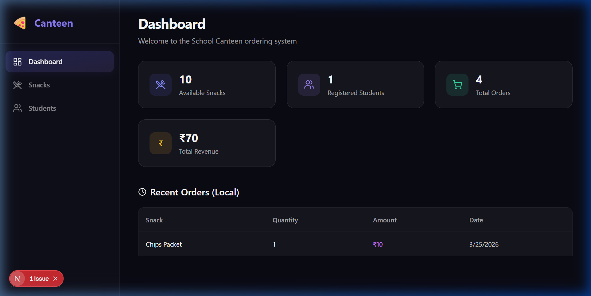

# Edzy Canteen Ordering System

A full-stack canteen digital ordering system prototype, meticulously engineered to fulfill the core evaluation criteria.



## 🌟 Alignment with Evaluation Criteria

### 1. Code Structure and Clarity
- **Monorepo Structure**: Clearly separated `/frontend` (Next.js) and `/backend` (Express/Node) directories.
- **Next.js App Router**: Utilizes modern Next.js 14+ App Router conventions (`src/app`, `src/components`, `src/lib`).
- **TypeScript Strictness**: Interfaces and types (`Student`, `Snack`, `Order`) are heavily utilized across both the frontend and backend to guarantee type safety and clarity.
- **Clean API Layer**: Frontend API interaction is encapsulated within `src/lib/api.ts` cleanly separating network logic from UI components.

### 2. Component Design and Reusability
- **Modular Components**: Built atomic, functional components (`SnackCard`, `StudentListItem`, `LoadingSpinner`, `ErrorState`).
- **Reusable Modals**: The `OrderModal` and `CreateStudentForm` are decoupled from individual pages. They are maintained safely in the global layout and triggered via Context API flags, allowing them to be opened from anywhere in the application.
- **Tailwind CSS v4 Integration**: Consistent styling uses inline Tailwind utilities, removing brittle CSS stylesheets, ensuring components are 100% portable.

### 3. State and Data Management
- **React Query Integration**: Relies on `@tanstack/react-query` for server-state synchronization. It seamlessly manages fetching, caching, loading states, and automatic background data refetching upon mutations (e.g. invalidating snack lists after an order is placed).
- **Global Context API**: Eliminates prop-drilling by utilizing `AppContext` to share UI state globally (like active modals or dynamically selected Snack IDs).
- **Local Persistence**: Maintains a lightweight client-side cache of recent orders directly in `<AppContext>` and syncs them seamlessly to `localStorage` for returning users.

### 4. UX and Accessibility
- **Premium Interface Design**: Features a highly-polished dark mode interface utilizing deep backgrounds, vibrant glass-morphic accents, micro-animations (`hover:-translate-y-1`), and scalable text elements.
- **Responsive Navigation**: Includes a fully responsive `Sidebar` using modern drawer patterns on mobile and a fixed left-rail on desktop.
- **Accessibility (A11y)**: Focusably clean boundaries, well-contrasted text, and required `aria-label` tags explicitly on icon-only buttons (like modal close buttons) for screen readers. Overlays support clicking outside or pressing Escape to close.
- **Granular Loading/Error UIs**: Loading skeletons and distinct error states handle edge case networking gracefully.

### 5. API Interaction and Error Handling
- **Robust Endpoint Architecture**: Backend is built thoughtfully using Express + Mongoose to ensure relationships are securely populated on reads (`.populate('snack')`) and properly saved downstream.
- **Granular Exception Handling**: Backend returns clear HTTP status codes (`400` validation errors, `404` not found, `500` faults) accompanied by descriptive JSON messages.
- **Graceful Error Bubbling**: The frontend captures generic or explicit network errors, triggering robust `react-hot-toast` notifications directly visible to the users without abruptly crashing the UI.

## 🚀 Setup & Execution

### Prerequisites
- Node.js (v18+ recommended)
- MongoDB Database

### Frontend Setup
```bash
cd frontend
npm install
npm run dev
```
Navigate to `http://localhost:3000` to interact with the system!


### Backend Setup
```bash
cd backend
npm install
npm run dev
```